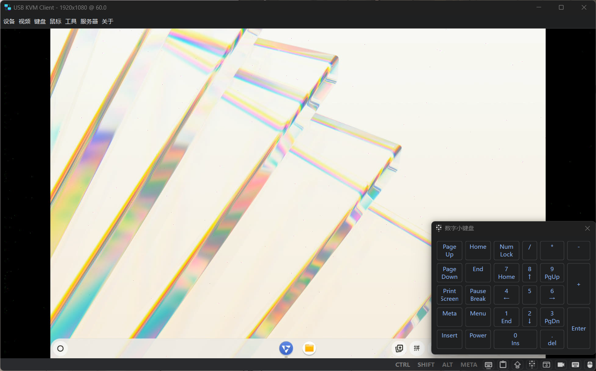
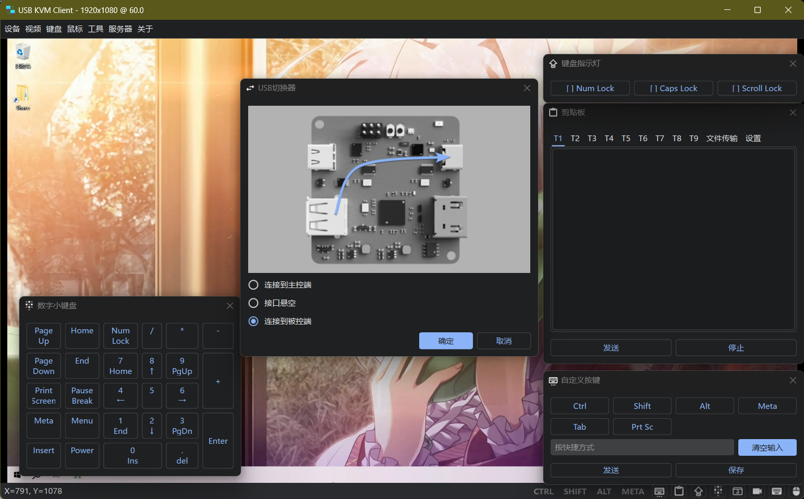

# forkKVM-Card-Mini

⌨️🖥️🖱️

Simple KVM Console to USB

一个简单的 KVM （Keyboard Video Mouse）设备控制卡，通过上位机程序控制被控设备的屏幕和键鼠

## About

**修改自 [Jackadminx/KVM-Card-Mini](https://github.com/Jackadminx/KVM-Card-Mini)**

增加主题/音频路由/录制/截图/内置远程服务器(魔改自Open-IP-KVM)/屏蔽系统键/剪贴板/无需系统支持的文件传输/特殊按键键盘等等功能, 迁移到PySide6以获得更好的nuitka支持, 优化了大量原版功能, 因为代码变动过大因此不对原项目PR

> [!TIP]
> 如果需要寻找一个非自制获取硬件的方案, 可参考[binnehot的文章](https://github.com/binnehot/KVM_over_USB_Q05)和[do21发现的问题](https://github.com/do21/KVM_over_USB_Q05)
> 
> 如果你正尝试在linux或macos上运行本项目, 可参考[#4](https://github.com/ElluIFX/KVM-Card-Mini-PySide6/issues/4)中的已知问题解决方法, 精力有限暂时无法处理跨平台适配问题

## Screenshot 

## Development

> [!IMPORTANT]
> 因为git的问题, 文件夹Client/data似乎没自动从Data变更为data, 请手动改名再编译, 如果直接用release文件的话可以无视, 这个版本把data编译进单文件了, 只需要直接运行exe即可

跨平台版本见cross-platform分支
